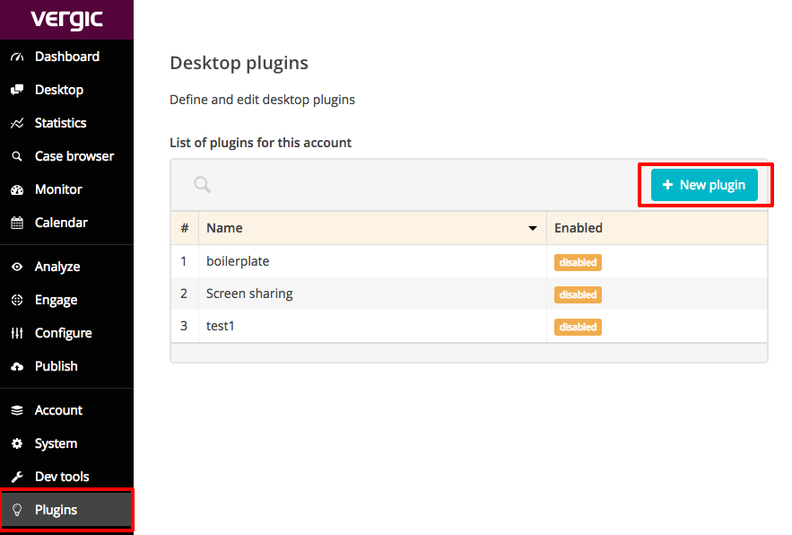

# vngage-desktop-plugin-mini
A lightweight foundation for a vngage desktop plugin.

### Installation
Clone the repository
```
git clone https://github.com/vergic/vngage-desktop-plugin-mini.git
```

Install parcel

```
yarn global add parcel-bundler
```

### Run
The plugin will only run on https.
Make sure you have certificate.cert and private.key.

```
cd vngage-desktop-plugin-mini
parcel index.html --cert certificate.cert --key private.key --https
```
go to [https://localhost:1234/](https://localhost:1234/)
And see that it runs

### Create a plugin in Vergic engage
1. In Vergic engage, go to the plugins tab
1. Click the "+New plugin" button
<center>
  
</center>

_You need the proper authorization to see the Plugins tab._

    1. Enter a plugin name in the popup
    1. Set the url to https://localhost:1234/
    1. Click save
1. Click your plugin in the plugins list
1. Go to the general tab
    1. Set the width to 400 and the height to 600
    1. Check the Enabled checkbox
1. Go to Active Groups, Subscriptions, and Actions and select what you need.
1. Click save
1. Go to the desktop tab in Vergic engage.
1. The plugin will be displayed on the left next to the sidebar


### starting a plugin outside of vergic engage (plug out)

parcel plugout.html --cert certificate.cert --key private.key --https

